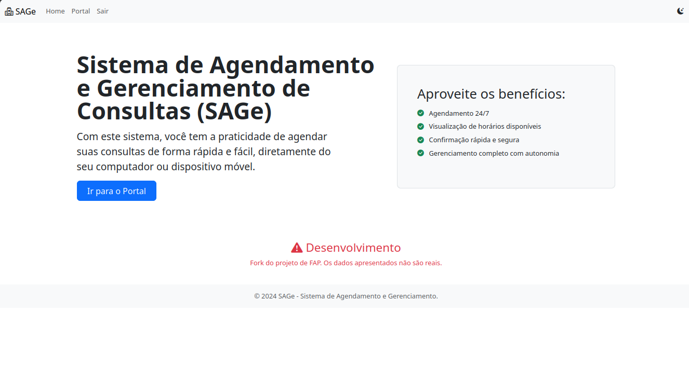

# SAGe - Sistema de Agendamento e Gerenciamento de Consultas



O **SAGe** é uma plataforma web desenvolvida para facilitar o agendamento e a gestão de atendimentos de forma rápida e intuitiva. O sistema permite que usuários visualizem horários disponíveis e realizem agendamentos diretamente pelo navegador, seja no computador ou em dispositivos móveis.

> [!IMPORTANT]  
> **AVISO DIDÁTICO:** Este projeto foi desenvolvido exclusivamente para fins educacionais e de aprendizado. Ele **não** possui todas as camadas de segurança e otimização necessárias para um ambiente de produção real. Não deve ser utilizado comercialmente sem os devidos ajustes e auditorias de segurança.

## 🚀 Funcionalidades

*   **Agendamento 24/7:** Disponibilidade para marcar consultas.
*   **Visualização de Horários:** Interface clara para checar slots disponíveis.
*   **Gerenciamento Autônomo:** O usuário tem autonomia para gerenciar suas próprias marcações.
*   **Interface Responsiva:** Desenvolvida com Bootstrap para funcionar em qualquer tamanho de tela.

## 🛠️ Tecnologias Utilizadas

*   **Backend:** [Django](https://www.djangoproject.com/) (Python)
*   **Frontend:** [Bootstrap 5](https://getbootstrap.com/), HTML5, CSS3
*   **Banco de Dados:** SQLite (padrão de desenvolvimento)
*   **Ícones:** Font Awesome / Bootstrap Icons

---

## 📋 Guia de Instalação

Siga os passos abaixo para configurar o ambiente de desenvolvimento em sua máquina local.

### 1. Pré-requisitos
Certifique-se de ter instalado:
*   Python 3.10 ou superior.
*   `pip` (gerenciador de pacotes do Python).
*   `venv` (módulo de ambiente virtual).

### 2. Clonar o Repositório
```bash
git clone git@github.com:Victor-HCSilva/SAGe-Fork.git
cd sage-projeto
```

### 3. Criar e Ativar o Ambiente Virtual
No Windows:
```bash
python -m venv venv
venv\Scripts\activate
```
No Linux/macOS:
```bash
python3 -m venv venv
source venv/bin/activate
```

### 4. Instalar Dependências
```bash
pip install -r requirements.txt
```

### 5. Configurar o Banco de Dados
Execute as migrações para criar as tabelas necessárias:
```bash
python manage.py migrate
```

### 6. Criar um Superusuário (Admin)
Para acessar a área administrativa do Django:
```bash
python manage.py createsuperuser
```

### 7. Executar o Servidor
```bash
python manage.py runserver
```
O sistema estará disponível em: `http://127.0.0.1:8000/`

---

## 📂 Estrutura do Projeto (Simplificada)

*   `core/`: Configurações principais do projeto Django.
*   `agendamentos/`: App responsável pela lógica de marcações e horários.
*   `templates/`: Arquivos HTML (utilizando a estrutura de blocos do Django).
*   `static/`: Arquivos CSS, imagens e JavaScript.

## ⚠️ Isenção de Responsabilidade

Este software é fornecido "como está", sem garantias de qualquer tipo. Como é um **fork de projeto didático** (conforme indicado no rodapé da imagem), os dados apresentados são fictícios e a arquitetura foca na demonstração de conceitos de CRUD e interface web.

---
**Fork do projeto o final do Curso FAP ofertado pela Softex Pernambuco**